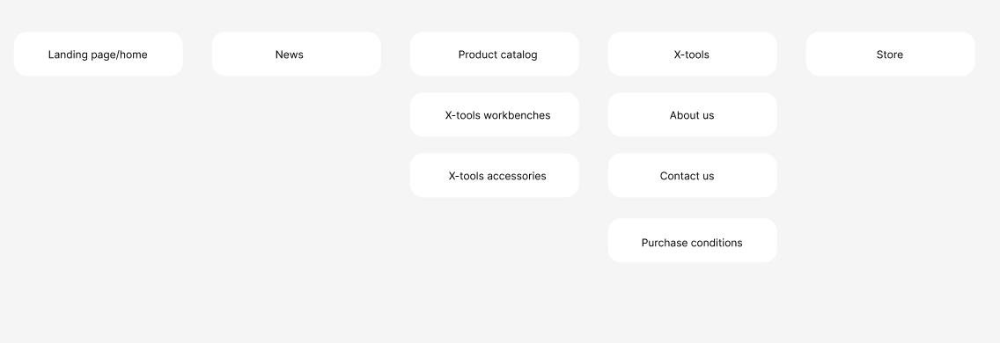
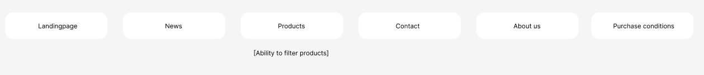

# Xtools productcatalog

## About the project

This is my graduation project as a frontend developer at Medieinstitutet. My customer is a company called XTools who sell ergonomic and portable carpentry benches and accessories. The target audience for this application is mainly other enterprises, but not excluding private customers. The goal with the website is to simplify the user flow throughout the application and provide a nice experience for potential customers. Another goal for this page is to remove the payment solution that the product owner(PO) previously used and instead implement purchase forms that the PO then can invoice the customers via.

## Tech stack

- React
- Typescript
- Axios
- Strapi
- Material UI (MUI) component library
- SendGrid

The web application is built with React and typescript in order to write correct and sustainable code.

MUI component library for React is used for both components and icons to keep a consistent design throught the website. MUI provides a great deal of documentation and I therefore chose to use this library since any other developer can turnt o the documentation if they were to change the components of the project.

Axios is used to fetch and post data from and to the database.

The Sendgrid plugin is used with a lifecycle hook in the application to send emails to the PO and customer, both when a message is submitted via the contact form and when a order is placed via the website. The axios post requests creates a contact object or an order object in the database which then triggers an email to be send through the plugin.

## Installation and setup of project

1. Clone the repo
   ```sh
   https://github.com/fanniewallner/GraduationProject.git
   ```
2. Install dependencies
   ```sh
   npm i
   ```
3. Run the app i frontend
   ```sh
   npm run dev
   ```
   3. Run the app i backend
   ```sh
   npm run develop
   ```

## User flow

As mentioned above, one primary goal is to simplify the user flow of the application. Below is the previous architecture of the web application as well as the new and improved architechture.

Previous userflow:


New userflow:


Xtools is a part of a company called Kreativa Snickare AB which is the POs' primary company. I therefor decided to remove the news section since the owner does not feel that he has the time to update as much as he wants and needs in order for this section to fill a purpose. The previous user flow had a redundant amout of pages which lead to the same url in the end which I have now removed and simplified.

## API Design

For this application I have used Strapi to build my sqlite database with javascipt.

Strapi is a headless CMS that comes with an admin panel where content types can be specified. This admin panel enables the PO of this project to manage content on his website without having coding experience. These content types generates basic controllers and services, providing endpoints for each content type to be fetched from. This way the PO can update, delete and create new products, add images to the media library and change contact fields such as company address, email, phonenumber etcetera to give him more freedom in maintaining the site himself.

The content types of the applications are collection types which are used for recurring content, and single types that are used for occasional instances.

Collection types:

- Product: Containing title, image, price, description, specification, category (relation to collection type category for filtering purpose), id generated by Strapi
- Category: Containing the fields 1:Work bench and 2:Accessory
- MediaGallery: Containing a collection of images uploaded to the media library in Strapi
- Order: Containing product name, product id, amount of products, customer first and last name, customer phonenumber, customer email and optional message.
- ContactForm: Containing firstname, lastname, email, phonenumber and message.

## Testing

Before implementation of code I have been conducting quick-and-dirty user tests of a prototype that I made with input from the PO. These tests gave us an insight in the behaviour of the potential user which I could take into care when writing the code for the application.

I have continuosly tested the applications behaviour with cypress to make sure the application does what I intended it to do.
